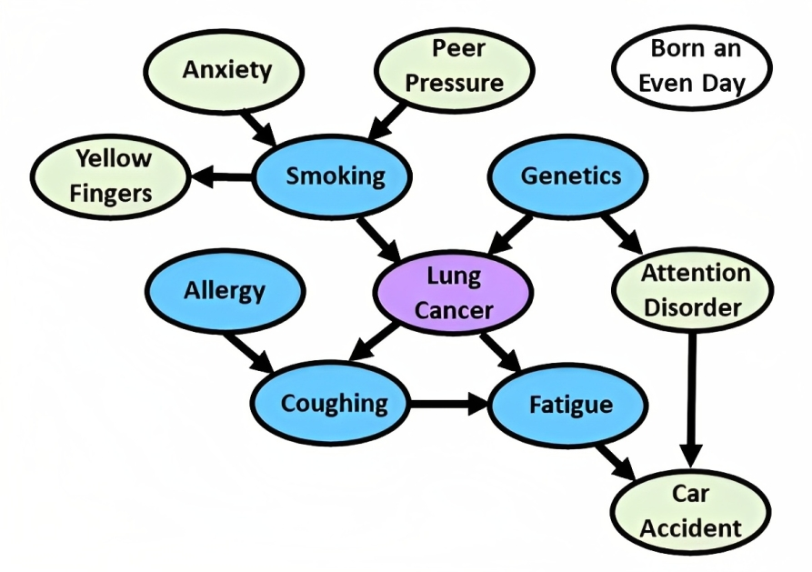
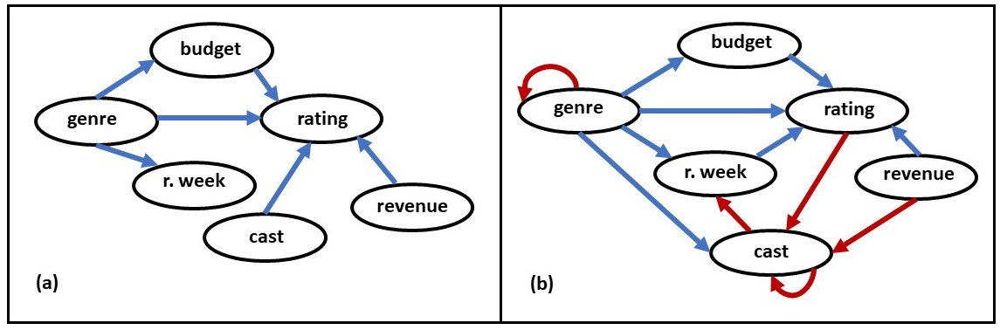
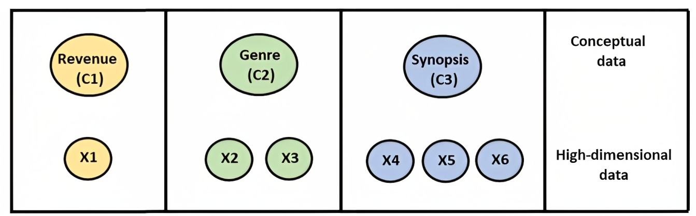
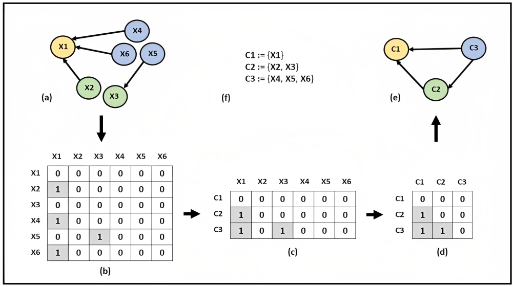

# CD-NOTEARS: Concept Driven Causal Structure Learning

This project is associated with the paper titled **"CD-NOTEARS: Concept Driven Causal Structure Learning using NOTEARS"**, published in the **2023 International Conference on Machine Learning and Applications (ICMLA)**. You can read the full paper [here](https://ieeexplore.ieee.org/abstract/document/10459827).

## Key Contributions

1. Introduced **CD-NOTEARS**, an extension of the original NOTEARS method that incorporates concept-level prior knowledge for causal discovery.
2. Demonstrated how concept-level DAGness can be imposed on high-dimensional data while preserving the non-parametric nature of the original NOTEARS method.
3. Evaluated the proposed method on synthetic, benchmark, and real-world datasets, showing that CD-NOTEARS outperforms the original implementation in scenarios where causality should be imposed at the concept level.
4. Provided insights into how incorporating concept-level knowledge improves causal discovery performance and lays the groundwork for future research in this direction.

## Visualizations

1. **Underlying Causal Graph for the LUCAS0 Dataset**  
     
   This plot illustrates the underlying causal graph for the LUCAS0 dataset, which serves as one of the benchmark datasets. (Referenced from: *Guyon, Isabelle et al. "Causality workbench." Causality in the Sciences. Oxford University Press, 2011.*)

2. **Comparison of CD-NOTEARS and Original NOTEARS on IMDb Dataset**  
     
   This plot shows the causal graph retrieved by the proposed CD-NOTEARS approach versus the state-of-the-art NOTEARS implementation on the IMDb movie dataset.

3. **Conceptual Data vs High-Dimensional Raw Feature Transformations**  
     
   This visualization highlights the transformation from high-dimensional raw features to concept-level data, demonstrating the focus of CD-NOTEARS on conceptual causal structure learning.

4. **Learning a DAG at the Concept Level Incorporating Prior Knowledge**  
     
   This plot illustrates how the CD-NOTEARS method learns the directed acyclic graph (DAG) at the concept level, incorporating prior knowledge into the causal discovery process.

## Dependencies

This source code builds upon the original NOTEARS implementation with modifications to support concept-level causal structure learning. It includes copies of the original NOTEARS files, with some files adapted to accommodate the conceptual knowledge integration.

For the original NOTEARS source code, please refer to [https://github.com/xunzheng/notears](https://github.com/xunzheng/notears).

